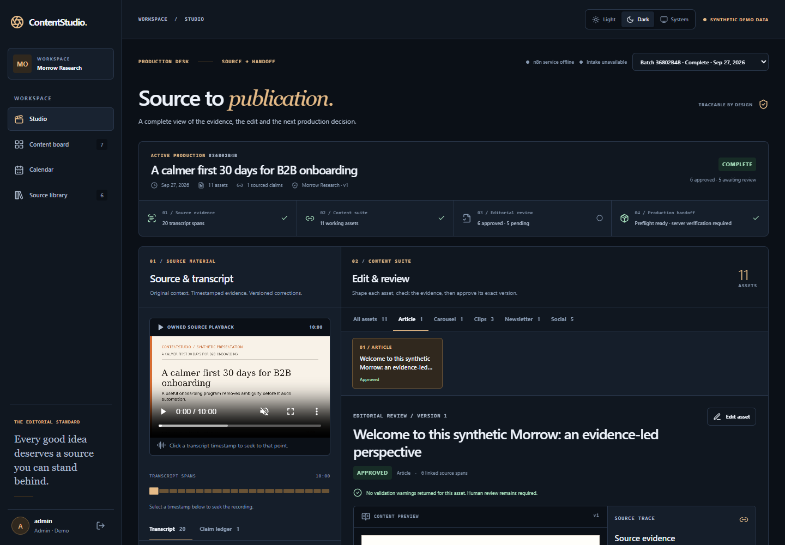

# ContentStudio

> Source-linked editorial production from owned recordings.



[Getting started](#getting-started) · [Architecture](docs/ARCHITECTURE.md) · [Evaluation](docs/EVALUATION.md) · [Security](docs/SECURITY.md)

## Overview

ContentStudio is a self-hosted editorial studio for owned talks and recordings. It creates source-linked article, newsletter, social, carousel, and clip drafts for human review. The project includes an importable n8n workflow pack, a FastAPI/LangGraph AI task, a React portal, local connector simulators, and a reproducible **Synthetic demo dataset**. See the [product description](docs/PRODUCT.md) and [implementation status](docs/IMPLEMENTATION_STATUS.md) before treating a test result as a release claim.

### Core workflow

**Source intake → asset drafts → evidence review → media render → publication package**

### Capabilities

- Transcript-linked claims and per-asset editing
- Reviewable article, newsletter, social, carousel and clip drafts
- Rendered media and downloadable publication package

### Technology

n8n · FastAPI · React · LangGraph · PostgreSQL

### Evidence and scope

The October production desk rollout passed 43 API tests, 23 workflow tests and seven appearance/preflight tests; browser checks covered both themes across desktop and mobile. Connected publishing remains subject to provider setup and live checks. The included demo uses synthetic data and local simulators. Deployment and live-provider limits are documented in [implementation status](docs/IMPLEMENTATION_STATUS.md).

## Getting started

Run the local demonstration from the repository root using the project-specific instructions below. External service credentials are needed only for connected integrations.

### Start the local demo

Prerequisites: Docker Desktop/Engine with Compose, free ports 4173/8000/5433 and the configured n8n/simulator ports, and enough disk for three synthetic presentations and the media volume. The default n8n/simulator host ports are 5678/8081. Set `API_HOST_PORT`, `N8N_HOST_PORT`, or `SIM_HOST_PORT` in `.env` if their defaults are occupied. On Windows PowerShell:

```powershell
Copy-Item .env.example .env
# Edit .env and replace every placeholder secret.
docker compose up --build -d
```

On POSIX:

```sh
cp .env.example .env
# Edit .env and replace every placeholder secret.
docker compose up --build -d
```

After configuration, `docker compose up --build -d` is the launch command. Open `http://localhost:4173`. Sign in as `admin@studio.test` with `DemoStudio!2026` unless `DEMO_PASSWORD` was changed. On a fresh demo database, the API seeds 12 fictional sources and a completed, downloadable 11-asset showcase. Its approval records are explicitly marked as synthetic demo decisions, not human editorial review. The first three source MP4s are locally generated synthetic presentations and are included under `fixtures/media`; the other nine sources are clearly transcript-only. These are not real customer recordings.

To execute new batches through **actual n8n**, complete first-time n8n owner/API-key and credential setup, import inactive workflows, and explicitly enable demo triggers. The exact commands and credential mapping are in [workflows/README.md](workflows/README.md). The project does not activate real-account schedules during import.

## Develop and verify

The API uses Python 3.12 and `uv` from `apps/api`; the portal uses Node 24 and pnpm from `apps/web`. Useful checks from the project root:

```text
python -m unittest discover -s tests/workflows -v
python scripts/n8n/bootstrap.py --dry-run
python evals/run_fixture_eval.py
python scripts/verify_media.py
docker compose --env-file .env.example config --quiet
```

The API's locked install/tests are `cd apps/api`, `uv sync --locked --extra dev`, `uv run alembic upgrade head`, and `uv run pytest -q`. The web checks are `cd apps/web`, `pnpm install --frozen-lockfile`, `pnpm lint`, `pnpm typecheck`, and `pnpm build`. `scripts/verify_media.py` needs FFmpeg; the API Docker image installs it. The Windows media regeneration script additionally needs accessible local SAPI voices.

## Documentation

- [Architecture and ERD](docs/ARCHITECTURE.md), [API](docs/API.md), [data card](docs/DATA_CARD.md)
- [Evaluation](docs/EVALUATION.md), [operations and restore](docs/OPERATIONS.md), [security](docs/SECURITY.md)
- [Dependencies](docs/DEPENDENCIES.md), [commercialization](docs/COMMERCIALIZATION.md)
- [Portfolio case study](docs/PORTFOLIO.md), [handover](docs/HANDOVER.md), [current status](docs/IMPLEMENTATION_STATUS.md)

Earlier on 2026-09-28, the local Compose demo ran all five services (web 4173, API 8000, n8n 15679, simulator 18081, PostgreSQL 5433). n8n 2.40.7 imported all seven workflows with credential/reference readback. [Intake replay evidence](workflows/evidence/replay-20260928T083343b793bd.json) records five successful, persisted 11-asset review bundles, an idempotent duplicate, and conflict/malformed Error Trigger runs. [Dispatch evidence](workflows/evidence/dispatch-429-duplicate-20260928.json) records a simulated 429, one n8n wait/retry, and one WordPress-like draft after a duplicate due trigger. The API applied PostgreSQL migration `c041f713d2a0`; a scoped database dump was restored into a disposable database. Later, Docker Desktop reported virtual-disk I/O errors, the API returned 500, and a project-only restart failed. The private `.env` now reserves API host port 18000 for recovery because another process holds 8000. A global Docker Desktop restart awaits owner approval because it would affect 26 running containers, including unrelated projects. These are historical local synthetic results, not a claim that the stack is currently healthy or production-ready. Connected model, transcription, and WordPress tests still need authorized credentials; the local demo never silently substitutes fixture success for a connected failure.


## Production desk and appearance

The source transcript, claim ledger, pinned brand version, exact-version review and delivery preflight stay visible together. Light, Dark and System preserve editor state and authored media colors. Read [the rollout report](docs/THEME_ROLLOUT.md), [configuration](docs/CUSTOMIZATION.md) and [representative screenshots](docs/evidence/theme-rollout/README.md) for verification and integration boundaries.
