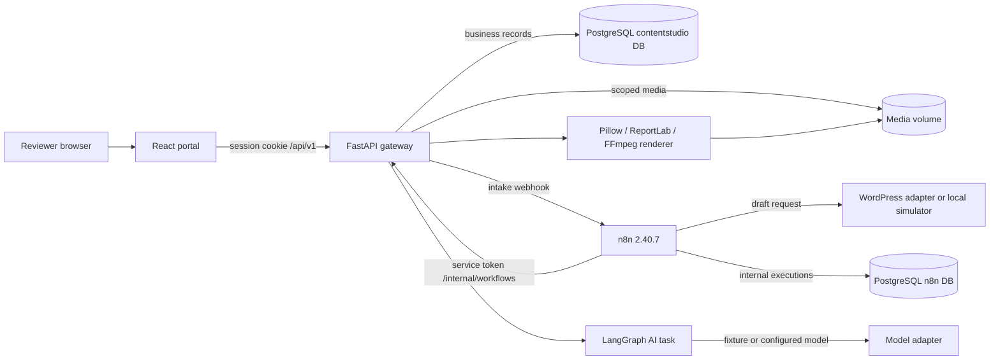
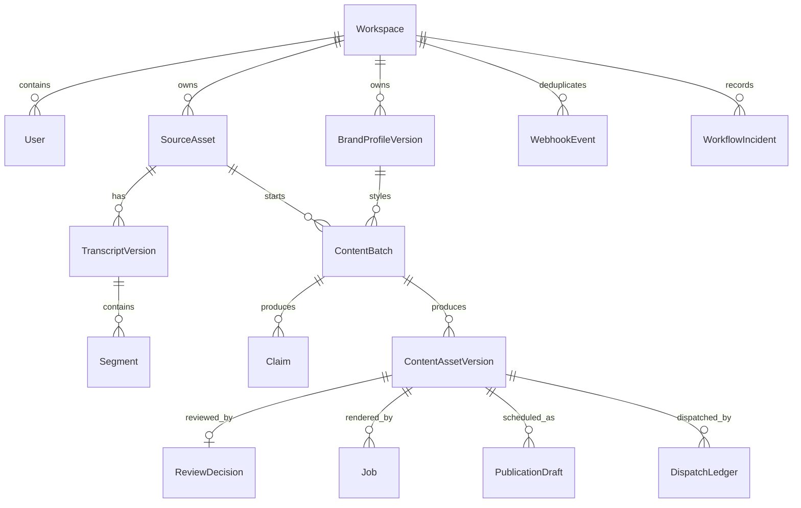

# Architecture

ContentStudio is one customer installation with two seeded demo workspaces. PostgreSQL owns business state and n8n stores its internal state in a separate database on the same server. Large media and rendered files live in workspace-scoped storage. A server-side session cookie represents the human user; a separate service token authenticates n8n internal calls.

The n8n pack has intake, render, dispatch, due-items, error, and reconciliation workflows. The checked-in manifest declares import order and credential/sub-workflow references. The bootstrap script imports inactive exports, wires references, and only publishes demo entrypoints when explicitly asked. n8n owns triggers, business branching, dispatch, and error routing. The Python graph does not trigger connector writes.

The AI graph is deterministic in structure: analyze transcript → build claim ledger → plan 11 assets → generate branches with bounded concurrency → check evidence/brand → revise once if a connected model draft has warnings → return a typed review bundle. In fixture mode, generation is local and reproducible. Postgres checkpoints are used when a Postgres URL is configured; SQLite is a local development convenience, not the commercial deployment database.

## State and safety boundaries

- Intake uses event ID and payload hash for duplicate/conflict detection. Batches are unique by workspace, source hash, recipe version, and brand version.
- A content asset has a stable logical ID and immutable version rows. Review decisions bind to a version hash; a source correction marks only dependent assets stale and clears their current render links.
- Dispatch uses a workspace-scoped operation key and payload hash. Unknown external outcomes need reconciliation; a database uniqueness constraint cannot by itself promise exactly-once delivery through WordPress.
- Routes, media paths, jobs, events, approvals, and calendar queries are workspace-scoped. A run or asset ID is never treated as authorization by itself.
- Uploads, rendered files, and exports stay in scoped storage. Graph state contains references and text, not large binary media.

## Operational boundaries

The default stack is single-process n8n plus one API, portal, PostgreSQL server, and connector simulator. Queue mode/Redis and public multi-tenant SaaS are outside v1. A crashed external dispatch may be ambiguous; reconciliation must inspect the provider before another write. The built-in demo uses local files and seeded users, while deployment needs a reverse proxy, TLS, secure cookies, real secrets, backups, and a tested restore. See `docs/OPERATIONS.md`.
